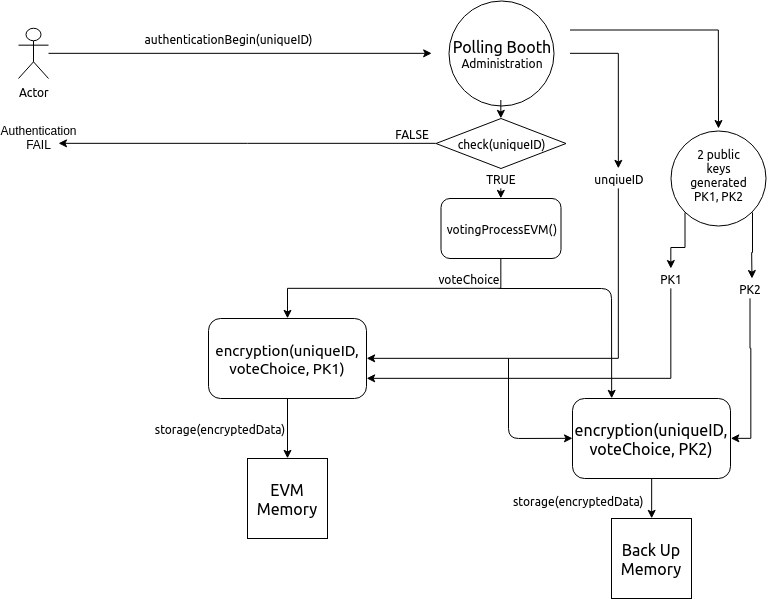
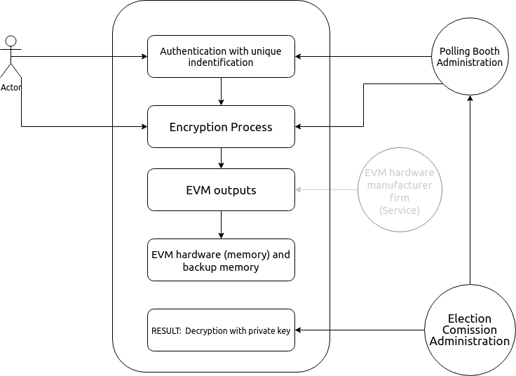

# Electronic Voting Machine Design

## Table of contents
1. [Introduction](#intro)
2. [Social Requirements](#social)
3. [Formal and Functional Specifications](#formal)
	- [EVM Process - UML](#one)
	- [System Administration - UML](#two)
	- [Decryption and Counting - UML](#three)
	- [Cryptographic system](#four)
4. [Challenges in India](#challenges)
5. [A General Discussion on Democracy](#talk)
6. [Informational Documents](#doc)

#### What is EVM?
EVM, i.e. electonic voting machines, are used to implement the process of voting by electronic machines, having replaced the use of ballot papers in India.

#### How does it work?
An EVM consists of two units, control unit and balloting unit, joined by a 5m wire cable, balloting unit provides the voting feature by voter via labelled buttons while control unit controls the ballot units, stores voting counts and displays the results on 7 segment LED displays, controller has its own OS and attached memory, it is impossible to change program in its hardware once it is manufactured; they are powered by a 6V alkaline battery.

#### Current situation

Essentially there are pros and cons using an EVM, they have reduced the wastage of papers, human work, and introduced the tint of technology in one of the important tasks of a nation, also it is easy to blame a machine of its corruptness and easy to point finger at its working, hence it is important to ensure that it will provide the basic necessities and is correct to its fundamental.

## Social Requirements 

Despite the variety of electoral
systems, legislative framework, and infrastructure, the following principles
pertain elections in all member states.

#### Generality

All citizens, unless otherwise stated by adjudication, above a certain age have the **right to vote**. This means that:
- Participation in the voting process of any voter shall always be confirmed, whenever needed.

#### No Coercion / Freedom

Everyone is free to vote for the party he/she considers more appropriate. The voting system has to ensures:
- **Uncoercibility** - incapable of being controlled.

Just because a voter wants to participate in voting, doesn't necessarily imply him to give vote to a party.
- **NOTA** - Ability for consciously vote for non-valid/none-of-the-above vote.

#### Equality

All voters and their votes must be considered to be equal. We should ensure the 
- **Eligibility** - Only eligible voters can vote, as dicussed in 'generality'.
- **Un-reusability/Un-changeability/Integrity** - We must ensure that one person shall be eligible for one and only one vote, no-one can duplicate his or someone else's vote, or change someone else's vote.

#### Verifiability

- **Verifiability** - The voter should have the possibility to verify that his vote is calculated in the final tally and is counted towards the party, he has voted for.

- **Accessibility**: Voters should have indiscriminating access to the
voting infrastructure.
- **Secrecy**
	- None of the people involved in the process of managing voting-system, shall be allowed for a legal interfere in it.
	- Registration, authentication and voting should be evidently separated.
	- **Transparency** shall always be maintained - 
		- With the design.
		- With its correctness.
		- With its usage.
		- With its counting and verification.

- **NOTE** : Votes should be validated separately and independently from voter authentication.

#### Proof of correctness

- **Correctness** - Any person, who shall choose to verify the correctness of such design, shall be able to do so.

- NOTE: Also, it ensures one of the main factors of transparency of the design, working and correctness.

#### Anonymity

- **Among Voters** - It should not be possible for any voter to prove about the party he voted for, outside the booth i.e. after his vote count has completed.

- **Among working staff** - It should not be possible for any staff working in voting system to see, or to identify the party any voter has voted for.

#### Non-repudiation

There should be an assurance that someone cannot deny something without any legal, logical and authorized document.

#### Certifiability / Tamper-proof

- **Before EVM usage** - It shall be possible to verify before the commencing of voting at a booth that EVM has not been tampered with.

- **Before counting** - It should be possible to identify that EVM is self-certifiable and it's not been tampered within the period of counting and tallying.

- **Hardware-check** - Any interference with hardware shall be able to get check, with an extreme rate of accuracy and precision.

#### Identification

- Every EVM has to have an unique ID number, with which it shall be possible to re-count and re-verify the votes of any special booth.

#### Directness

- Electors select directly their representatives, meaning that: No person, shall be an intermediaries, or can be authorised to vote for another person.

## Formal and Functional specification of alternative EVM design

### EVM - UML diagram

### System and administration service - UML diagram

### Decryption and Counting - UML diagram

### Cryptographic system

Cryptography is an essential part of providing data confidentiality, integrity, and authentication in the security and thus used with similar aim. In this cryptosystem, the encryption key is public and it is different from the decryption key which is kept private.

### RSA algorithm

RSA algorithm can be categorized in 4 steps:

1. Key generation
	- Choose two distinct prime numbers p and q.
		- p and q should be chosen at random, and should be similar in magnitude but differ in length by a few digits to make factoring harder.
	- Compute n = pq, n is used as the modulus.
	- Compute λ(n) = lcm(λ(p), λ(q)) = lcm(p − 1, q − 1), where λ is Carmichael's totient function. This value is kept private.
	- Choose an integer e such that 1 < e < λ(n) and gcd(e, λ(n)) = 1; i.e., e and λ(n) are coprime.
	- Determine d as d ≡ e−1 (mod λ(n)); i.e., d is the modular multiplicative inverse of e (modulo λ(n)).
	- e is released as the public key exponent.
	- d is kept as the private key exponent which must be kept secret alongwith p, q and λ(n).

2. Key Distribution

	- For using public key, polling booth administration gives the (n, e) which can be use to encrypt data.
	- For decryption, (d) is preserved at Election Commission administration.

3. Encryption
	-  c = mod(m^e /n) where m is the integer corresponding to the plaintext that we want to encrypt.

4. Decryption
	- c^d = mod((m^e)^d / n), given d, it is easy to decrypt the required integer m, which can be converted into plaintext.

### Proof / Verifiablity of Cryptosystem

## Challenges for EVM in India : External Reasons

- **Cost** : We need our design to be a product that can be manufactured easily i.e. it shouldn't be costly as over a million EVMs are used in a major voting event.

- **Power** : Over 300 million of Indians live with no access to proper electricity; EVMs should be able to operate entirely from battery power, not merely using battery as a backup.

- **Natural Hazards** : We need its hardware tough enough to bear the different climate conditions of India, from extremes of temperature, to dust and pollution. EVM should operate under all possible conditions.

- **Illiteracy** : Machine is designed to use instructions without written scripts, since a person need not be literate in order to vote, right to vote is fundamental and must always be respected in every situation.

- **Unfamiliarity with Technology** : EVMs should be simple enough that it could be used by any illiterate person with extremely low level of technological knowledge to any expert in technology.

- **Booth-capturing** - Incase, a booth is captured by a anonymous force, the machine shall preserve the counted number of votes if possible, if not, it shall only count vote within certain intervals of time, for e.g. 4 votes in a minute, which will ensure that votes won't get tampered too much until help arrives.

## Points of improvement and some thoughts

- There can be a remote server that stores the votes of EVM, the information can be communicated via internet securely.
- It is even possible to make a advancement in this total process of voting through machines to make it e-voting, it is quite a dream right now, as major places in India lacks of proper electricity, but it can seen as a reason for technological advancement.  

## A General Discussion on Democracy.

[Democracy](https://en.wikipedia.org/wiki/Democracy) has its definition rooted in the choice of majority i.e. rule of the people, by the people, for the people. But it will work essentially then, when we divide our system into many social classes, culture and money. When we elect a person and give him the power to manage critical stuff, we hereby create a social class superior in power to others, it is essentially analogical to the king-rule system of ancient world.

Whereas, [communism](https://en.wikipedia.org/wiki/Communism) works just the other, in political and social sciences, communism is the ideology and movement whose ultimate goal is the establishment of the communist society, which is a socioeconomic order structured upon the common ownership of the means of production and the absence of social classes, money and the state.

I, personally, support the communist society, given that humanism is overlapped bound of social animalism.s

##  Informational Documents

- [RSA algorithm wikipedia](https://en.wikipedia.org/wiki/RSA)
- [Security Analysis of India’s Electronic Voting Machines](https://indiaevm.org/evm_tr2010-jul29.pdf)