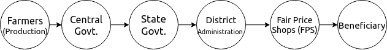
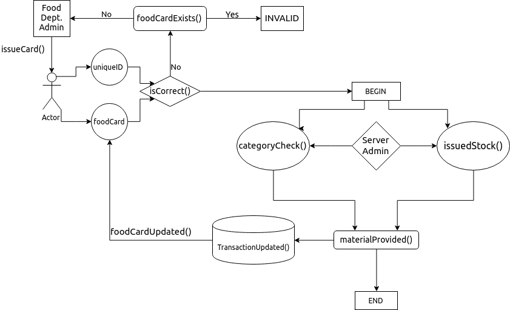

# Public Distribution System Design

**AIM** : A functional design to automate the public distribution system in India with more transparency, more conversion rate and less corruption

## Table of contents
1. [Introduction](#intro)
2. [Responsibilities and Fallouts](#one)
3. [Formal Specification of PDS Design](#two)
	- [System Overview - UML](#twoone)
	- [PDS Design - UML](#twotwo)
4. [Feasibility Discussion](#three)
	- [Anti-corruption Feasibility](#threeone)
	- [Economic Feasibility](#threetwo)
	- [Technical Feasibility](#threethree)
	- [Social Feasibility](#threefour)
5. [A Word About NFSA](#four)

### What is Public Distribution System?

Indian food security system, established by the Government of India under Ministry of Consumer Affairs, Food and Public Distribution is to distribute subsidized food and non-food items to India's poor. 

### Responsibilities

The central and state governments share the responsibility of regulating the PDS.
- Central government is responsible for procurement, storage, transportation, and bulk allocation of food grains.
- State governments hold the responsibility for distributing the same to the consumers through the established network of Fair Price Shops (FPSs). 
- State governments are also responsible for operational responsibilities including allocation and identification of families below poverty line, issue of ration cards, supervision and monitoring the functioning of FPSs.

### Fallouts of PDS

PDS has not been at its best, it consists of a large share of defects. Let's analyse some of them
- **Quality of Food** : Consumers have reported an inferior quality food.
- **Corruption of Dealer**
	- Dealers replace quality goods supplies from FCI with inferior and old inventory stock.
- **Corruption of Shop owners**
	- Creates fake card numbers to recieve stock by fake names to sell legally in open market.
	- Holding and then selling the stock in black markets.
- **Identification of Poor class** : More than 30% poor class have no awareness about this scheme, and were unable to get identified legally as BPL(below poverty line).
- **Irregular Categorisation of Poverty line distinction** : This non ambiguity gives massive scope for corruption and fallouts in PDS systems.

## Formal Specification of PDS-Design

####  System Overview

####  PDS Design

#### Functions Usage

- **isCorrect(unqiueID, foodCard)** : Returns true if the details of foodCard is in correspondance with the uniqueID provided by the actor.
- **foodCardExists()** : Returns if the database has information about issuing a foodCard earlier on this uniqueID.
- **issueCard()** : Returns an new issued card to the beneficiary with the provided details by him/her.
- **categoryCheck()** : Returns the category related to the uniqueID provided
- **issuedStock()** : Returns the maximum of stock that is remaining to be issued under the unique ID provided.
- **materialProvided()** : Provide the stock material to the beneficiary.
- **TransactionUpdated()** : Update the stock issued in the database.
- **foodCardUpdated()** : Update the foodCard renewal if needed.
- **NOTE** : uniqueID is assumed as the Aadhaar card, since it is unique for every Indian citizen.

## Feasibility Discussion

### Anti-corruption Feasibility

- The database can be made online, which can be maintained by a separate system. Due to this higher level of transparency, it will become very hard for the human corruption.
- Since, every grain of food, issued to the FPS has to be calculated per uniqueID and should always be keep on updated before the allowance of material; it will open less doors for illegal stock selling

### Economic Feasibility

- According to the economic survey of India report, 75% of the total money allocated for distribution is not utilized for the purpose it is intended for.
- After this design implementation, with several better changes, it is expected that more than 90% of the allocated stock shall be delivered to the right beneficiary

### Technical Feasibility

- Technical requirements for the design consists of some computers, a state centralized server and the maintainence of database, which compared to its outputs and the rate of transparency, makes it easy to use.
- It will introduce technical jobs all over the country and will help in technological advancements.

### Social Feasibility

- Since, Indian system has the details related to each Indian citizen's uniqueID, it is easy to check the families above and below the poverty line.
- Identification of actual poor people living below poverty line will be done to a good level of percision, hence will be a better step for identifing the right beneficiary. 

## A Word About NFSA(National Food Security Act, 2013)

- [**National Food Security Act**](https://en.wikipedia.org/wiki/National_Food_Security_Act,_2013), 2013 (also **Right to Food** Act) is an Act of the Parliament of India which aims to provide subsidized food grains to approximately two thirds of India's 1.2 billion people.
- It includes the [**Midday Meal Scheme**](https://en.wikipedia.org/wiki/Midday_Meal_Scheme), [**Integrated Child Development Services**](https://en.wikipedia.org/wiki/Integrated_Child_Development_Services) scheme and the [**Public Distribution System**](https://en.wikipedia.org/wiki/Public_Distribution_System).

